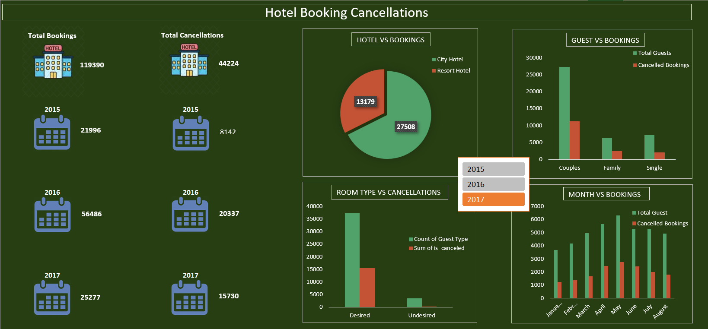

# Hotel Booking Cancellation Analysis

## Overview

This project analyzes hotel booking data to identify cancellation trends, customer behavior, booking patterns, and factors affecting hotel reservation cancellations. An interactive Excel dashboard was created to help stakeholders monitor key metrics and make data-driven decisions.

## Problem Statement

Hotel cancellations can significantly impact revenue and occupancy planning. The objective of this project was to analyze booking data, identify cancellation patterns, and uncover insights that can help reduce cancellation rates.

## Tools Used

* Microsoft Excel
* Pivot Tables
* Pivot Charts
* Data Cleaning
* Dashboard Design
* Business Analysis

## Dashboard Features

* Total Bookings and Total Cancellations
* Year-wise Booking Analysis (2015–2017)
* Hotel Type vs Bookings
* Guest Type vs Cancellations
* Room Type vs Cancellation Analysis
* Monthly Booking and Cancellation Trends
* Interactive Year Filter

## Key Insights

* Analyzed **119,390 hotel bookings** and **44,224 cancellations**.
* City Hotels accounted for a larger share of bookings than Resort Hotels.
* Couples generated the highest number of bookings and cancellations.
* Desired room types experienced significantly more cancellations than undesired room types.
* Booking volume peaked during the summer months, with cancellations increasing alongside booking demand.
* Cancellation rates increased considerably in 2017 compared to previous years.

## Business Recommendations

* Implement targeted retention strategies for high-cancellation customer segments.
* Offer flexible booking modifications instead of cancellations.
* Optimize pricing and promotional campaigns during peak cancellation periods.
* Improve room allocation processes to reduce customer dissatisfaction.

## Dashboard Preview

## Project Outcome

Developed an interactive Excel dashboard that transformed raw booking data into actionable business insights, enabling better occupancy planning, revenue management, and cancellation reduction strategies.

## Author

Abhishek Tripathi

Aspiring Data Analyst | Excel | SQL | Python | Power BI
